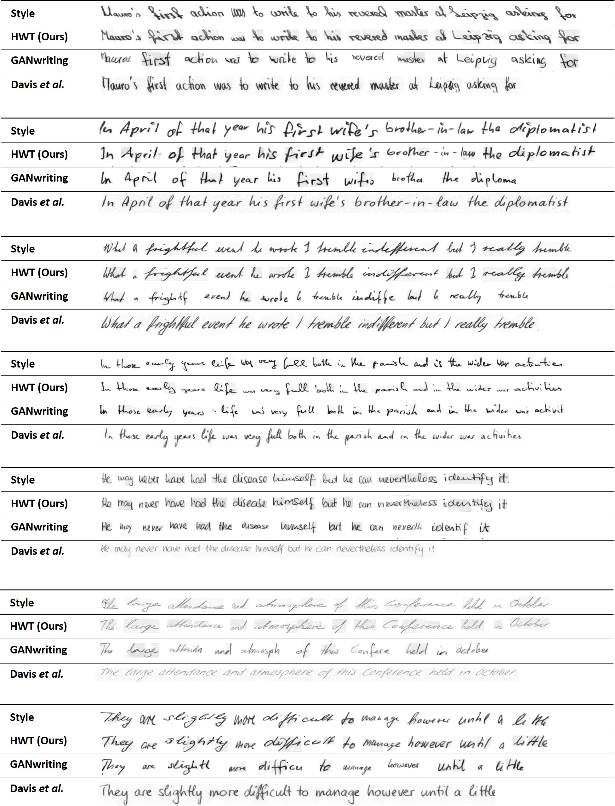

#  Handwriting Transformers  
 
 <p align="center">

</p>


> **Abstract:** 
>*We propose a novel transformer-based styled handwritten text image generation approach, HWT, that strives to learn both style-content entanglement as well as global and local writing style patterns. The proposed HWT captures the long and short range  relationships within the style examples through a self-attention mechanism, thereby encoding both global and local style patterns. Further, the proposed transformer-based HWT comprises an encoder-decoder attention that enables style-content entanglement by gathering the style representation of each query character. To the best of our knowledge, we are the first to introduce a transformer-based generative network for styled handwritten text generation. Our proposed HWT generates realistic styled handwritten text images and significantly outperforms the state-of-the-art demonstrated through extensive qualitative, quantitative and human-based evaluations. The proposed HWT can handle arbitrary length of text and any desired writing style in a few-shot setting. Further, our HWT generalizes well to the challenging scenario where both words and writing style are unseen during training, generating realistic styled handwritten text images.* 


## Software environment

- Python 3.7
- PyTorch >=1.4

## Setup & Training

Please see ```INSTALL.md``` for installing required libraries. You can change the content in the file ```mytext.txt``` to visualize generated handwriting while training.   


Download Dataset files and models from https://drive.google.com/file/d/16g9zgysQnWk7-353_tMig92KsZsrcM6k/view?usp=sharing and unzip inside ```files``` folder. In short, run following lines in a bash terminal. 


You can change different parameters in the ```params.py``` file.

You can train the model in any custom dataset other than IAM and CVL. The process involves creating a ```dataset_name.pickle``` file and placing it inside ```files``` folder. The structure of ```dataset_name.pickle``` is a simple python dictionary. 

```python
{
'train': [{writer_1:[{'img': <PIL.IMAGE>, 'label':<str_label>},...]}, {writer_2:[{'img': <PIL.IMAGE>, 'label':<str_label>},...]},...], 
'test': [{writer_3:[{'img': <PIL.IMAGE>, 'label':<str_label>},...]}, {writer_4:[{'img': <PIL.IMAGE>, 'label':<str_label>},...]},...], 
}
```
 
## Handwriting synthesis results


 <p align="center">

</p>

 <p align="center">

</p>


## Handwriting reconstruction results
 Reconstruction results using the proposed HWT in comparison to GANwriting and Davis et al. We use
the same text as in the style examples to generate handwritten images.

 <p align="center">

</p>

<!-- 



 -->


